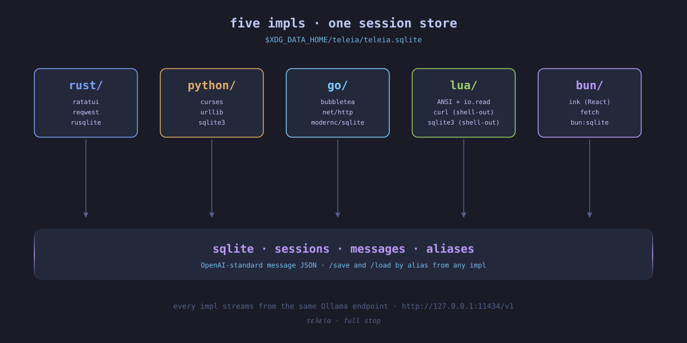

<p align="center">
  
</p>

<p align="center">
  <a href="https://github.com/foolish-dev/Teleia/actions/workflows/ci.yml"></a>
  <a href="LICENSE"></a>
</p>

Minimal TUI coding agent — one MVP, **five** parallel implementations. Each talks to a local Ollama (OpenAI-chat-compatible) endpoint, runs four tools (`read` / `write` / `edit` / `bash`), and persists sessions to SQLite.

## Implementations

| dir | language | TUI | HTTP | store |
| --- | -------- | --- | ---- | ----- |
| [`rust/`](rust/)     | Rust 1.95+   | ratatui + crossterm        | reqwest          | rusqlite              |
| [`python/`](python/) | Python 3.11+ | curses (stdlib)            | urllib (stdlib)  | sqlite3 (stdlib)      |
| [`go/`](go/)         | Go 1.22+     | bubbletea + lipgloss       | net/http         | modernc.org/sqlite    |
| [`lua/`](lua/)       | Lua 5.4+     | ANSI + io.read (line mode) | shell-out `curl` | shell-out `sqlite3`   |
| [`bun/`](bun/)       | Bun 1.3+     | ink (React, TSX)           | global `fetch`   | `bun:sqlite`          |

All five share scope and behaviour: same system prompt, same four tools, same 16-hop cap, same default model (`hf.co/FoolDev/Thanatos-27B:Q4_K_M`), same Tokyo Night palette. They write to the same on-disk sqlite at `$XDG_DATA_HOME/teleia/teleia.sqlite` — a session `/save NAME`'d in one impl can be `/load NAME`'d from any other.

Each subdir has its own README with deeper notes.

<p align="center">
  
</p>

## Install

A small rust installer at [`install/`](install/) builds whichever impls have their toolchain present (`cargo`, `python3`, `go`, `lua5.4`, `bun`) and drops `teleia-{rust,python,go,lua,bun}` into `$PREFIX` (default `~/.local/bin`):

```sh
cd install && cargo run --release
```

Or run any impl directly from its subdir:

```sh
cd rust   && cargo run --release
cd python && python -m teleia
cd go     && go run ./cmd/teleia
cd lua    && lua teleia.lua
cd bun    && bun install && bun run start
```

Requires Ollama running at `127.0.0.1:11434` with a tool-capable model installed. Override the model with `--model NAME` and the endpoint with `--base-url URL` on any impl.

<p align="center">
  
</p>

## Features

- **Streaming** SSE — tokens render live as the model produces them.
- **Tool loop**: `read` / `write` / `edit` / `bash`, with a 16-hop cap.
- **Slash commands**: `/reset`, `/save NAME`, `/load NAME`, `/help`.
- **Scrollback**: ↑ / ↓ (PageUp / PageDown) in rust/python/go/bun. Lua relies on terminal scrollback.
- **Persistent sessions** at `$XDG_DATA_HOME/teleia/teleia.sqlite`. Save/load by alias across runs and across impls.
- **Single provider**: Ollama (OpenAI-chat-compatible), one model per process.

Not yet: MCP, LSP, plugins, subagents, multi-provider, web UI.

## Why polyglot

Same problem, five stacks, side-by-side — useful for comparing idiom, terseness, dependency posture, and TUI ergonomics. The shared sqlite makes the impls swappable mid-conversation: pick whichever is most ergonomic for the moment without losing context.

## License

MIT — see [LICENSE](LICENSE).
