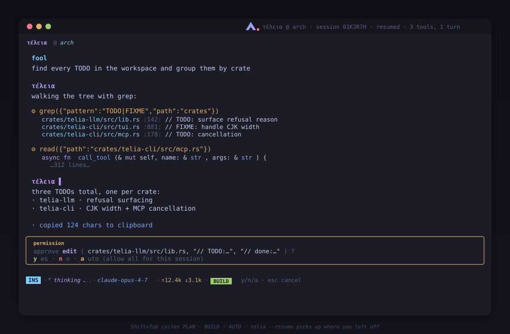

<p align="center">
  
</p>

<p align="center">
  <a href="https://github.com/foolish-dev/teleia/actions/workflows/ci.yml"></a>
  <a href="LICENSE"></a>
  <a href="https://buymeacoffee.com/cardoffoolm"></a>
</p>

<p align="center">
  <a href="https://huggingface.co/FoolDev/Janus-35B"></a>
  <a href="https://huggingface.co/FoolDev/Thanatos-27B"></a>
</p>

**λ τέλεια — a minimal TUI coding agent (rewritten in Rust btw).** One binary, no daemon. Talks to a local Ollama or any of twenty cloud chat-completions endpoints (≈210 named models in the dropdown) and hosts MCP + LSP servers. Ships a minimal core of **39 built-in tools** — files, search, code lint/test, git, JSON, encoding, and web — dispatched in a tool-call loop until the model stops asking (`bash` and MCP servers cover the rest). Persists sessions to SQLite, resumes where you left off, and paints an OS-aware welcome banner on launch.

<p align="center">
  
</p>

## Install

Auto-detects your platform, downloads the latest prebuilt binary from GitHub Releases, falls back to a cargo source build if no prebuilt exists. Prebuilts cover Linux (x86_64 · aarch64 · armv7 · i686 · riscv64 · ppc64le · s390x), macOS (Intel + Apple Silicon), Windows (x86_64 · ARM64 · i686, MSVC + MinGW), and FreeBSD.

```sh
# Linux / macOS — drops `teleia` into ~/.local/bin
curl -fsSL https://raw.githubusercontent.com/foolish-dev/teleia/dev/install.sh | sh
```

```powershell
# Windows (PowerShell) — drops `teleia.exe` into %USERPROFILE%\.local\bin
irm https://raw.githubusercontent.com/foolish-dev/teleia/dev/install.ps1 | iex
```

```sh
# any platform with Rust installed
cargo install --git https://github.com/foolish-dev/teleia teleia-cli
```

After install it verifies the binary, appends the install dir to your shell rc / Windows user PATH if needed (idempotent), and hints at the next step for either an Ollama or a cloud-provider session.

Overrides (env vars before the pipe on Unix, `$env:NAME = 'value'` on Windows):
`PREFIX` install location (default `~/.local/bin`) ·
`TAG` pin a release tag (default `latest`) ·
`FROM_SOURCE=1` skip the prebuilt download and cargo-build from source ·
`BRANCH` source-build branch (default `dev`) ·
`NO_PATH=1` skip the PATH edit ·
`NO_OLLAMA_HINT=1` skip the post-install nudge ·
`AUTO_INSTALL=1` bootstrap rustup automatically if cargo is missing on a source build (no prompt) ·
`NO_AUTO_INSTALL=1` never bootstrap; fall back to the manual-install error.

On a source build with no Rust toolchain present, the installer otherwise prompts on `/dev/tty` (Unix) or `Read-Host` (Windows) before running the official rustup-init.

`cargo run --release` works from a workspace clone.

Upgrade an existing install in place with `teleia --self-update` — it downloads the latest prebuilt for your platform, verifies it against the release `SHA256SUMS`, and swaps the binary. No shell re-run needed.

## Run

```sh
# default: local Ollama with hf.co/FoolDev/Thanatos-27B
teleia

# cloud — uses $ANTHROPIC_API_KEY, or prompts and saves the key
teleia --model claude-fable-5

# resume the last session
teleia --resume     # alias: --continue, -r

# start in plan mode (read-only tools) or auto (no prompts)
teleia --plan
teleia --auto
```

Inside the TUI, switch models live with `/model NAME`; switch providers by changing the prefix. `Shift+Tab` cycles permission modes. Type `/help` to list every slash command.

## Permission modes

Three stances control tool execution — cycle with `Shift+Tab` or set explicitly:

| mode      | chip    | behaviour                                                                  | trigger              |
| --------- | ------- | -------------------------------------------------------------------------- | -------------------- |
| **PLAN**  | blue    | only read-only tools run — filesystem reads, search, inspection, `sha256`, `web_search`, and `fetch` (plus `git`'s `status` / `diff` / `log`); every mutating tool short-circuits with a synthetic "blocked: plan mode" result | `/plan`, `--plan`    |
| **BUILD** | green (default) | every tool call pauses for `y` allow / `n` deny / `a` allow-all (auto)                          | `/build`, default    |
| **AUTO**  | red     | every tool dispatches immediately, no prompts                              | `/auto`, `--auto`    |

`a` at any approval prompt allow-alls and flips into AUTO for the rest of the session. `Esc` denies.

## Keybindings

Four modes: **Insert** (default — type and edit), **Normal** (`Esc` to enter; vim motions), **Visual** (`v` from Normal; charwise selection over the chat scrollback), **Command** (`:` from Normal; vim ex-commands). The status-bar chip and input border colour signal the active mode.

### Insert mode

| key                       | does                                                                |
| ------------------------- | ------------------------------------------------------------------- |
| `Tab`                     | accept autocomplete / ghost suggestion                              |
| `Shift+Tab`               | cycle permission mode (PLAN → BUILD → AUTO)                         |
| `Enter`                   | submit                                                              |
| `Esc`                     | dismiss menu → clear drag-select → switch to Normal                 |
| `Up` / `Down`             | history recall, or menu nav, or 1-line scroll (in priority order)   |
| `PageUp` / `PageDown`     | scroll chat 5 lines                                                 |
| `Left` / `Right`          | cursor                                                              |
| `Home` / `End` / `Ctrl+A` / `Ctrl+E` | line start / end                                         |
| `Ctrl+U`                  | clear input                                                         |
| `Ctrl+W`                  | delete word before cursor                                           |
| `Backspace` / `Delete`    | delete char before / at cursor                                      |
| `Ctrl+Shift+V`            | paste from system clipboard (bracketed paste)                       |
| middle-click              | paste from system clipboard (X11-style; works in any mode)          |
| drag-select               | copy highlighted chat text (Wayland: wl-copy; else arboard; → tmux → OSC 52) |
| `Ctrl+C`                  | abort the streaming turn                                            |

### Normal mode (`Esc` to enter)

| key                          | does                                                  |
| ---------------------------- | ----------------------------------------------------- |
| `i` / `a` / `I` / `A`        | back to Insert (cursor / after / line start / line end) |
| `v`                          | Visual mode (charwise selection in chat scrollback)   |
| `:`                          | Command mode                                          |
| `h` / `l` or `Left` / `Right` | cursor                                                |
| `0` / `$` or `Home` / `End`  | line start / end                                      |
| `w` / `b` / `e`              | word forward / back / end                             |
| `j` / `k` or `Down` / `Up`   | scroll chat 1 line                                    |
| `Ctrl+D` / `Ctrl+U`          | half-page scroll                                      |
| `PageDown` / `PageUp`        | 5-line scroll                                         |
| `gg` / `G`                   | jump to oldest / latest entries (G re-engages follow) |
| `x` / `X`                    | delete char at / before cursor                        |
| `D`                          | delete from cursor to end of input                    |
| `dd`                         | clear input                                           |
| `Tab`                        | accept suggestion                                     |
| `Shift+Tab`                  | cycle permission mode                                 |
| `Enter`                      | submit                                                |

### Visual mode (`v` from Normal)

Charwise selection over the rendered chat scrollback — the keyboard equivalent of a left-click drag. The selection anchor drops at the top-left of the inner chat area; the hardware terminal cursor tracks the selection head so you can see where motions are taking you. `y` copies the highlighted text through the same channel stack as mouse drag-select (Wayland: wl-copy; else arboard; → tmux → OSC 52) and returns to Normal with the highlight still visible. `Esc` cancels and clears the highlight.

| key                          | does                                                  |
| ---------------------------- | ----------------------------------------------------- |
| `h` / `l` or `Left` / `Right` | move selection head left / right (anchor stays)      |
| `j` / `k` or `Down` / `Up`   | move selection head down / up                         |
| `0` / `Home`                 | snap selection head to row start                      |
| `$` / `End`                  | snap selection head to row end                        |
| `y`                          | yank selection to clipboard, exit to Normal           |
| `Esc`                        | cancel selection, exit to Normal                      |

### Command mode (vim ex-commands)

From Normal mode, `:` opens a command line. The dropdown filters `EX_COMMANDS` by prefix; `Tab` / `Shift+Tab` cycle, `Enter` runs, `Esc` (or `Backspace` on an empty buffer) cancels. Vim aliases dispatch to the same handlers as the slash-commands:

| ex command                                              | does                                                  |
| ------------------------------------------------------- | ----------------------------------------------------- |
| `:q` / `:qa` / `:qall` / `:x` / `:exit`                 | quit                                                  |
| `:w NAME` / `:wa` / `:wq NAME`                          | save session (no quit on `:wq`)                       |
| `:e NAME` / `:l NAME` / `:edit NAME` / `:load NAME`     | load session                                          |
| `:d NAME` / `:bd NAME` / `:delete NAME`                 | delete session                                        |
| `:ls` / `:list`                                         | list sessions                                         |
| `:enew` / `:new` / `:reset`                             | reset session                                         |
| `:clear`                                                | clear scrollback                                      |
| `:colo NAME` / `:colorscheme NAME` / `:theme NAME`      | theme                                                 |
| `:cd PATH` / `:pwd`                                     | working directory                                     |
| `:f` / `:file` / `:show` / `:info`                      | session info                                          |
| `:model NAME`                                           | switch model                                          |
| `:notify on|off` / `:transparent on|off`                | toggles                                               |
| `:key PROVIDER` / `:keys`                               | api keys                                              |
| `:mcps` / `:lsps` / `:tools`                            | tool inventory                                        |
| `:plan` / `:build` / `:auto` / `:ask`                   | permission mode                                       |
| `:copy` / `:yank` / `:y`                                | copy last assistant reply                             |
| `:prompt NAME`                                          | prompt template                                       |
| `:help` / `:h` / `:version`                             | misc                                                  |

### Mouse

| gesture                       | does                                                       |
| ----------------------------- | ---------------------------------------------------------- |
| left-click + drag in chat     | drag-select; release copies via arboard / tmux / OSC 52    |
| scroll wheel                  | scroll chat 3 lines per tick                               |

## Tools

**39 built-ins** — a deliberately minimal core; `bash` covers everything else, and MCP servers add domain tools to the same dispatch loop. Every tool has a JSON-schema definition sent to the model; run `/tools` in the TUI for the live inventory. Read-only tools stay enabled in [PLAN mode](#permission-modes); mutating tools are gated.

- **Files & directories** — `read` `write` `edit` `multi_edit` `apply_patch` `rm` `cp` `mv` `mkdir` `touch` `symlink` `stat` `du` `realpath`
- **Search & listing** — `list` `glob` `grep` `tree` `diff` `which` `wc` `head` `tail`
- **Code: lint / test** — `lint` `format` `typecheck` `test`
- **Git** — `git` (`status` / `diff` / `log` / `add` / `commit`)
- **JSON & encoding** — `json` (RFC 6901 pointer) `replace` (regex) `base64` `hexdump` `sha256`
- **System & web** — `bash` `env` `date` `fetch` `web_search`
- **Session** — `todo_write`

A few worth calling out: `read` syntax-highlights via scope-aware syntect; `edit` does a unique-substring replace (fails if `old_string` isn't unique unless `replace_all`); `bash` combines stdout/stderr with a 30 s timeout; `web_search` is keyless (DuckDuckGo); `sha256` is hand-rolled (no hash crate). `lint`/`format`/`typecheck`/`test` auto-detect the toolchain by file extension.

## Providers

The model name picks the provider. Use `provider:NAME` to disambiguate names that collide with local Ollama models.

| pattern                            | provider     | env var                 |
| ---------------------------------- | ------------ | ----------------------- |
| `claude-*`                         | Anthropic    | `ANTHROPIC_API_KEY`     |
| `gpt-*`, `o1*`, `o3*`, `o4*`       | OpenAI       | `OPENAI_API_KEY`        |
| `gemini-*`                         | Google       | `GEMINI_API_KEY`        |
| `grok-*`                           | xAI          | `XAI_API_KEY`           |
| `deepseek-*`                       | DeepSeek     | `DEEPSEEK_API_KEY`      |
| `mistral-*`, `codestral-*`         | Mistral      | `MISTRAL_API_KEY`       |
| `command-*`                        | Cohere       | `COHERE_API_KEY`        |
| `sonar*`                           | Perplexity   | `PERPLEXITY_API_KEY`    |
| `jamba-*`                          | AI21         | `AI21_API_KEY`          |
| `groq:NAME`                        | Groq         | `GROQ_API_KEY`          |
| `openrouter:NAME`                  | OpenRouter   | `OPENROUTER_API_KEY`    |
| `together:NAME`                    | Together AI  | `TOGETHER_API_KEY`      |
| `fireworks:NAME`                   | Fireworks    | `FIREWORKS_API_KEY`     |
| `cerebras:NAME`                    | Cerebras     | `CEREBRAS_API_KEY`      |
| `hyperbolic:NAME`                  | Hyperbolic   | `HYPERBOLIC_API_KEY`    |
| `nvidia:NAME`                      | NVIDIA NIM   | `NVIDIA_API_KEY`        |
| `anyscale:NAME`                    | Anyscale     | `ANYSCALE_API_KEY`      |
| `lepton:NAME`                      | Lepton       | `LEPTON_API_KEY`        |
| `deepinfra:NAME`                   | DeepInfra    | `DEEPINFRA_API_KEY`     |
| `sambanova:NAME`                   | SambaNova    | `SAMBANOVA_API_KEY`     |
| anything else                      | local Ollama | _none_                  |

`claude-*` models route through Anthropic's native Messages API (prompt caching, native tool-use, `x-api-key`); every other cloud provider uses the OpenAI-compatible `/chat/completions` path. The `/model` dropdown pre-populates with ~210 named models across all twenty providers. `Tab` accepts, type to filter; any name is accepted including ones not in the catalog.

**Keys.** `--api-key KEY` overrides the env-var fallback. Missing a key at startup or after `/model NAME`? teleia prompts with hidden input (`rpassword` at startup, in-TUI masked prompt mid-session) and saves the entered key under `prefs.api_key:<ENV_VAR>` so the next launch picks it up. `/keys` lists every provider + status; `/key PROVIDER` opens the prompt on demand. Env-var values win when set, so exporting overrides the saved one.

**Ollama pre-flight.** When the resolved endpoint is local Ollama, missing models trigger an interactive `pull from Ollama now? [Y/n]` with an animated progress bar. `--pull-yes` auto-confirms; `--no-pull` skips. Non-TTY stdin (scripts, CI, pipes) auto-confirms.

## Features

- **OS-aware welcome banner** — `/etc/os-release` (or `cfg!(target_os = …)` on macOS / Windows / FreeBSD) picks a pixel-art panel: Arch / Ubuntu / Debian / Fedora / Alpine / NixOS / Gentoo / Void / openSUSE / macOS / Windows / FreeBSD or a generic Linux fallback. Lambda mark + `powered by λ τέλεια` watermark below.
- **Modes** — Insert (default), Normal (`Esc`), Visual (`v` from Normal), Command (`:`). The status bar chip and input border colour signal the active mode.
- **Slash commands** — `/reset`, `/clear`, `/save NAME`, `/load NAME`, `/delete NAME`, `/list`, `/model [NAME]`, `/key PROVIDER`, `/keys`, `/mcps`, `/lsps`, `/tools`, `/plan`, `/build`, `/auto`, `/prompt [NAME]`, `/theme [NAME]`, `/notify [on|off]`, `/transparent [on|off]`, `/copy`, `/cd PATH`, `/pwd`, `/version`, `/show`, `/help`, `/quit`.
- **Vim commands** — `:q`/`:x`/`:qa`/`:qall` → quit, `:w`/`:wa` → save, `:e`/`:l` → load, `:colo`/`:theme` → theme, `:!CMD` → shell out, `:cd PATH`, `:pwd`, `:noh` (clear drag-select), `:version`, `:r FILE` (read into chat), `:enew` → reset. `EX_COMMANDS` dropdown autocompletes via Tab.
- **Prompt templates** — `/prompt` lists 10 starters (`review`, `debug`, `explain`, `refactor`, `test`, `docs`, `security`, `perf`, `commit`, `plan`); `/prompt NAME` drops the template into the input box.
- **Autocomplete** — ghost-text completion as you type + a drop-down listing every match. Up to 10 entries visible at a time; longer lists scroll via Up/Down keeping the selected row in view. Title shows total count (`models · 211`).
- **Input editing** — readline-style `Left`/`Right`/`Home`/`End`, `Backspace`/`Delete`, `Ctrl+A/E/U/W`; `Up`/`Down` recall prior submissions. Typing stays live during a streaming turn; the input box grows vertically with content (cap = 1/3 of screen).
- **Smart auto-scroll** — defaults to following the bottom. Scrolling up disengages bottom-following so streaming deltas don't yank you back down mid-read; reaching the bottom (scroll 0) via any down gesture re-engages. `G` jumps to bottom + re-engages. Scroll math uses `Paragraph::line_count` so it always lands at the last rendered visual row.
- **Scrollbar** — right-edge thumb in `th.purple` over a `th.dim` track; only renders when there's overflow.
- **Drag-select** — left-click + drag in the chat area highlights cells; release copies via [`arboard`](https://crates.io/crates/arboard) (Wayland / X11 / macOS / Windows). Works during streaming.
- **Reasoning stream** — reasoning models stream their chain-of-thought to a dimmed `τέλεια · thinking` block, kept separate from the answer and never written back to the wire.
- **Themes** — `tokyo-night` (default), `catppuccin`, `dracula`. Code highlighting follows the active theme (scope-aware mapping via syntect).
- **Blur & transparency** — `/transparent on` (or `TELEIA_TRANSPARENT=1`) swaps the theme background for `Color::Reset`, letting the terminal's alpha and the compositor's blur bleed through. Pair with `alpha=0.85` in foot/alacritty + Hyprland's blur decoration; selection highlight, status chips, and mode badges stay opaque so they remain legible. See [`docs/RICE.md`](docs/RICE.md).
- **Desktop autotheme** — pair teleia with the external [`grogu`](https://github.com/foolish-dev/grogu) binary to fan the active theme out to Noctalia shell, niri, vim/neovim, and back into teleia's own prefs. `grogu apply` (no args) reads the `theme` row teleia writes to its sqlite store, so `/theme dracula` → `grogu apply` repaints the desktop without typing the theme name twice. Designed to run as a Noctalia post-wallpaper-change hook so wallpaper rotation re-themes the system.
- **Token tracker** — status bar shows `↑prompt ↓completion` totals for the session.
- **Desktop notifications** — Linux `notify-send`, macOS `osascript`, Windows BurntToast (silently no-op if not installed). Toggle with `/notify on|off`.
- **Streaming** — tokens render live via SSE with a blinking caret, braille spinners on tool calls, and a running-dot "thinking" indicator. `Esc` / `Ctrl+C` mid-turn aborts.

## Session persistence

Everything important survives a restart.

- **Messages** stream to SQLite as they arrive — no "unsaved" state. Store lives at `$XDG_DATA_HOME/teleia/teleia.sqlite` (Linux), `~/Library/Application Support/teleia/teleia.sqlite` (macOS), `%APPDATA%\teleia\teleia.sqlite` (Windows). `$XDG_DATA_HOME` wins on any platform when set.
- **Auto-bookmarks** — every launch is tagged `last`; `/reset` rotates the outgoing session to `prev`. So `teleia --resume` always picks up where you left off, and the run before that is recoverable with `/load prev`. Each session also gets a durable `s-YYYY-MM-DD-HHMMSS` alias so none orphan.
- **Aliases** — `/save NAME` + `/load NAME` for sessions you want to keep by hand.
- **Sticky preferences** — theme, `/notify` toggle, `/transparent` toggle, permission mode, reasoning-effort tier, active model, and per-provider API keys all persist (CLI flags override). Launching `teleia` with no `--model` picks up wherever you last `/model`-ed.
- **Input history** — last 500 submissions reload into the `Up`/`Down` recall buffer at startup, deduped against the most recent entry.

## Configuration

Optional TOML at `$XDG_CONFIG_HOME/teleia/config.toml` (Linux), or the OS-native config dir on macOS / Windows.

```toml
# Custom LLM endpoint. The name shows up in /model alongside the
# pre-populated cloud + Ollama-cached entries.
[llms.groq-llama]
base_url    = "https://api.groq.com/openai/v1"
api_key_env = "GROQ_API_KEY"

# MCP server. Spawned at startup; tools join the agent's catalogue.
# `env` overrides the parent process for this child only.
[mcps.filesystem]
command = "npx"
args    = ["-y", "@modelcontextprotocol/server-filesystem", "/tmp"]

[mcps.github]
command = "docker"
args    = ["run", "-i", "--rm", "ghcr.io/github/github-mcp-server"]

[mcps.github.env]
GITHUB_PERSONAL_ACCESS_TOKEN = "ghp_…"

# LSP server. Spawned + initialised at startup; pull diagnostics and
# hover are exposed to the agent as `lsp_diagnostics` and `lsp_hover`.
# Definition / references / workspace ops are still TODO.
[lsps.rust]
command       = "rust-analyzer"
root_patterns = ["Cargo.toml"]
```

**MCP**: teleia speaks newline-delimited JSON-RPC over stdio — `initialize` + `notifications/initialized` + `tools/list` + `tools/call` + `resources/list`. Spawn failures stderr-warn but don't abort boot. `/mcps` lists running servers with tool + resource counts.

**LSP**: real Content-Length-framed JSON-RPC client. Each configured server gets `initialize` + `initialized`. `/lsps` shows live status + advertised `serverInfo`. `lsp_diagnostics` (pull diagnostics) and `lsp_hover` are exposed to the agent; one-shot `textDocument/didOpen` lazily on first request. Definition / references / workspace ops are still TODO.

## Layout

```
crates/
  teleia-cli       # `teleia` binary + TUI + MCP client + LSP client
  teleia-agent     # turn loop, permission gate, event stream
  teleia-llm       # chat / pull / tags streaming, provider detection
  teleia-tools     # the 39 built-in tools + dispatch
  teleia-tools-bin # same dispatch as a stdin/stdout CLI
  teleia-store     # sqlite session + prefs + input-history persistence
```

Built on `ratatui` + `crossterm`, `reqwest` (rustls), `rusqlite` (bundled), `syntect` (no C deps), `arboard`, `rpassword`.

## Rice

Hyprland / niri starter configs for floating τέλεια in a Tokyo
Night-palette terminal with matching borders, rounded corners, and a
purple→cyan accent gradient: [`docs/RICE.md`](docs/RICE.md). Foot /
alacritty / kitty palette + JetBrains Mono Nerd Font included.

## License

MIT — see [LICENSE](LICENSE).

---

<p align="center">
  <a href="https://buymeacoffee.com/cardoffoolm"></a>
</p>
